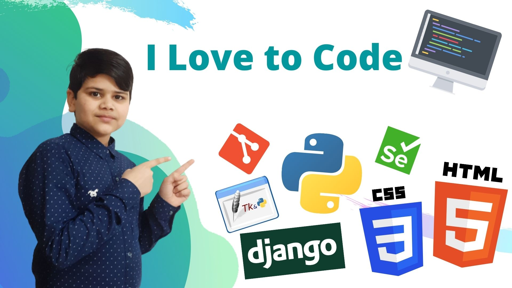

<h1>Hi I'm <a href="https://yashvarshney.herokuapp.com/">Yash</a></h1>

<h3>My Name is<a href="https://yashvarshney.herokuapp.com/"> Yash Varshney</a></h3>

I'm Yash from India, and I am an intermediate python programmer. I currently Working on Python Programming Language. I have an interest in Data Analysis, GUI FrameWorks, Full-Stack WebDevelopment etc.

#### Skills: Python, Automation, VCS Work, Full-Stack-Web Development, GUI FrameWork(Tk), Django Web FrameWork.

- 🔭 I’m currently working on Web Development with Python
- 🌱 I’m currently learning Django, Python, HTML, CSS 
- 📫 How to reach me: <a href="mailto:yash.gurukul12@gmail.com">E-mail</a>, <a href="https://www.reddit.com/user/Yash_Varshney">Reddit</a> or <a href="https://github.com/Yash-Programmer/Yash-Programmer/issues/new">Create a issue</a>

 
  

<h2>Languages And Tools</h2>

<h2>🤝 Contributing</h2>

I Love to contribute and explore new projects. I keep contributing and still I am doing it.

<h2>Connect & Say 👋</h2>

            
            
            
            
